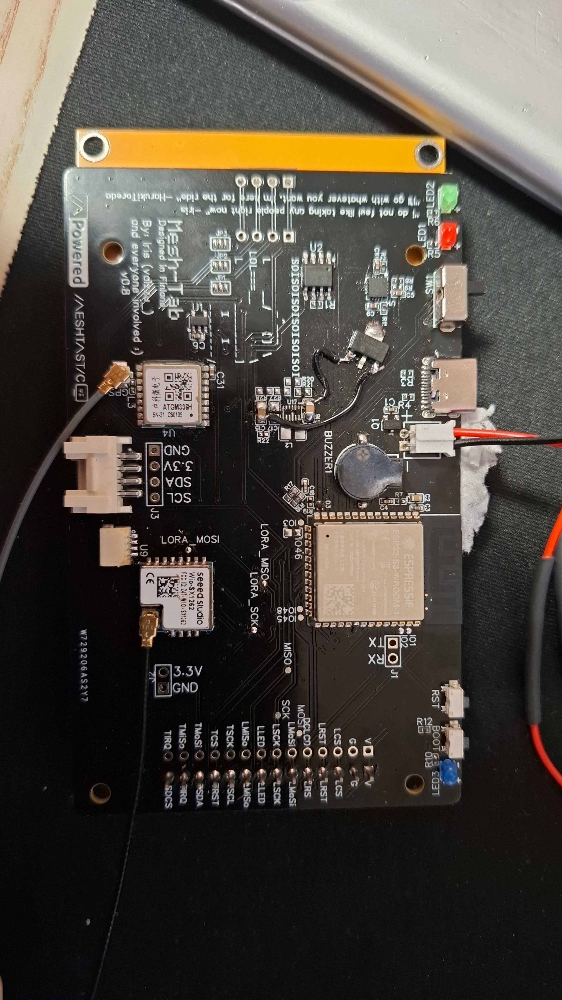

# Mesh-Tab

# Disclaimer: this is not yet ready :) 

**Mesh-Tab** is a community-driven board design focused on creating experimental touchscreen nodes similar to smartphones. The project is divided into multiple stages, each with specific design goals.

## Sponsorship

This project is proudly sponsored by [PCBWay](https://www.pcbway.com/).  
Thanks to their support for providing high-quality PCB manufacturing and assembly services.

## Target Stages

- **Stage 1:** An ESP32-based touchscreen node designed for the new "Fancy UI" by mverch🇩🇪, with an emphasis on keeping costs low.
- **Stage 2:** A hybrid node that combines ESP32 and nRF chips on the same board. The ESP32 will serve as the GPU for the UI while the screen is active, along with touchscreen control. The nRF chip will handle LoRa communication for efficient performance. Once the screen times out, the ESP32 will enter sleep mode, with the nRF chip maintaining Meshtastic functionality.
- **Stage 3:** A fully nRF-based node with an eInk screen, aiming to incorporate a custom-made UI (not yet developed).

## Stage 1: Target Hardware

The following components are being considered for Stage 1 until better alternatives are found:

- **Custom PCB:** Work in progress. can be ordered form various pcb manufacturers like, for example from our sponsor [PCBWay](https://www.pcbway.com/)
- [**Ra-01sh**](https://vi.aliexpress.com/item/1005002561194884.html) - LoRa chip that can be manually soldered.
- [**ESP32-S3-WROOM-1-N16R2**](https://www.digikey.com/en/products/detail/espressif-systems/ESP32-S3-WROOM-1-N16R2/16162644) - ESP32 chip that can also be manually soldered.
- [**3.2" TFT LCD ILI9341**](https://www.aliexpress.us/item/3256806072260865.html) - Custom PCB being designed to fit this screen.
- [**L76K GPS**](https://www.waveshare.com/wiki/L76K_GPS_Module) - Aiming to use this GPS module for its ultra-low power consumption.
- [**LC76G GPS**](https://www.waveshare.com/product/lc76g-gnss-module.htm) - Slightly more consumption than the L76k but more constallation supported.
- [**868/915MHz SMA M Antenna**](https://www.aliexpress.us/item/3256804421300249.html)
- [**IPEX Cable SMA**](https://www.aliexpress.us/item/3256807231603277.html)
- [**8000mAh Battery**](https://www.aliexpress.us/item/2251832758431717.html)
- **Case:** Coming soon.

## Stage 1: Target Features

- Touchscreen larger than 3"
- Power switch allowing charging while off
- Solar charging capability
- Buzzer for notifications
- I2C port for expansion
- GPS UART port with software-controlled power management
- Under/over/reverse polarity battery protection
- SD card port for future development

## Stage 2: Target Hardware

- **Custom LoRa nRF Board:** Being designed to plug into the smart display board, containing LoRa and nRF chips.
- [**ESP32-S3 Development Board 4.0" 480 x 480 Smart Display**](https://vi.aliexpress.com/item/1005006478501734.html) - Recommended by mverch🇩🇪, comes prebuilt with an integrated ESP32 chip.
- [**ProMicro nRF Board**](https://www.aliexpress.us/item/3256807196955871.html) - Low-power nRF development board.
- [**L76K GPS**](https://www.waveshare.com/wiki/L76K_GPS_Module) - Selected for ultra-low power consumption.
- **Case:** Coming soon.

# Additional hardware for stage 1

[Ra-01sh](https://vi.aliexpress.com/item/1005002561194884.html) - select the version with the ipex connector

ESP32 S3
 - [aliexpress](https://vi.aliexpress.com/item/1005005230800143.html) - select S3-WROOM-1-N16R2

  or

 - [mouser](https://www.mouser.fi/ProductDetail/356-ESP32S3WRM1N16R2)

[LEDs](https://a.aliexpress.com/_EHxXAUv) - u need red, green and blue.

screens:
 - resistive

   [3.2 inch IPS](https://vi.aliexpress.com/item/1005006258575617.html) - select the one with touch

   [3.5 inch TN](https://vi.aliexpress.com/item/32985467436.html) - select the one with touch

   [3.5 inch IPS](https://vi.aliexpress.com/item/1005006333922639.html)
   
 - capasitive

    [3.2 inch IPS](https://vi.aliexpress.com/item/1005006952065332.html)

    [3.5 inch IPS](https://vi.aliexpress.com/item/1005006893699919.html)

    [4 inch IPS](https://vi.aliexpress.com/item/1005007082906950.html)

[buzzer](https://a.aliexpress.com/_EughDX3) -  select 9032 3.6v passive

battery:

 - [5000mAh](https://vi.aliexpress.com/item/1005005216499731.html)

 - [8000mAh](https://a.aliexpress.com/_EJIpkHP)

[PH 2 connector](https://vi.aliexpress.com/item/33011797617.html) - select 2p. this is where the battery connects

[connector for battery](https://vi.aliexpress.com/item/1005006623049916.html)

[ipex to sma](https://vi.aliexpress.com/item/4000848776660.html) - select IPEX to SMA-K and 5cm for length

antenna:

[868Mhz](https://vi.aliexpress.com/item/32972870968.html) - DO NOT SELECT RP-SMA

[868Mhz and 915Mhz](https://vi.aliexpress.com/item/1005004607615001.html) - DO NOT SELECT RP-SMA

## Additional Hardware Considerations

- **ESP32 Board:**
  - [**Vision Master T190 Board**](https://heltec.org/project/mesh-node-t114/) - A temporary option for testing; eventually, we aim to create our own.

- **Touch Displays (3 inches or larger):**
  - [**2.4 inch TFT LCD Shield Touch Panel Display Module**](https://www.aliexpress.us/item/3256802101900425.html) - Uses the same driver as the T-Deck, making integration easier.
  - [**ESP-32-S3 5-inch**](https://vi.aliexpress.com/item/1005006715581887.html) - Comes with an integrated ESP32 for handling the UI.
  - [**T-Display S3 Pro**](https://www.lilygo.cc/products/t-display-s3-pro?variant=43111690141877) - An iPhone-like replacement for the T-Deck.

- **LoRa Modules:**
  - [**Wio-SX1262**](https://www.seeedstudio.com/Wio-SX1262-Wireless-Module-p-5981.html)
